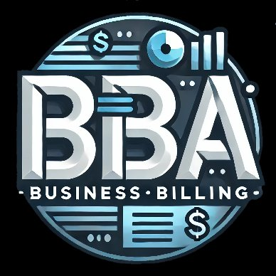

# BBA

  

  <h3>Frontend</h3>
  
  
  
  

  <h3>Backend</h3>
  
  
  

## 🏢 About The Project

BBA is a comprehensive business management solution designed for businesses of all sizes, with special features for pharmaceutical distributors and retailers. It streamlines billing, inventory management, customer relationship management, and business analytics, providing a user-friendly interface for managing day-to-day business operations.

## 🚀 Features

- **📊 Dashboard**: Real-time business analytics with visual charts and graphs, overview of daily, monthly, and annual sales, top-performing products analysis, revenue tracking and forecasting

- **💼 Customer Management**: Comprehensive customer database, customer profiles with contact information and purchase history, customer-specific discount management, due period tracking

- **📝 Invoice Generation**: Create and manage professional invoices, multiple payment mode support, automatic tax calculation (CGST, SGST, IGST), discount application at both product and customer levels

- **📦 Inventory Management**: Real-time stock tracking, batch management with expiry date tracking, low stock alerts, fast-moving product identification, company/manufacturer tracking

- **🏢 Company Management**: Manage relationships with suppliers and manufacturers, track company-specific products, maintain company contact information

- **📈 Subscription Management**: Manage recurring billing, track subscription status and renewals, automated billing for subscription-based services

- **⚙️ Settings & Customization**: Business profile customization, tax rate configuration, user management and access control, email template customization

## 📱 Pages

### Dashboard
- Overview of business statistics
- Sales and revenue analytics
- Top products visualization
- Company-wise distribution charts

### Customers
- Customer database management
- Search and filter functionality
- Customer profile viewing and editing
- Purchase history tracking

### Invoices
- Create new invoices
- Manage existing invoices
- Filter by status, date, and customer
- PDF generation and email sending

### Inventory
- Stock level monitoring
- Batch and expiry tracking
- Low stock alerts
- Fast-moving product identification

### Companies
- Supplier and manufacturer management
- Company contact information
- Company-specific product tracking

### Subscriptions
- Recurring billing management
- Subscription status tracking
- Renewal notifications

### Settings
- Business profile customization
- Tax rate configuration
- User management
- Email template customization

## 🛠️ Built With

### Frontend
- [React](https://reactjs.org/) - UI library for building the user interface
- [TypeScript](https://www.typescriptlang.org/) - Type-safe JavaScript for robust code
- [Ant Design](https://ant.design/) - UI component library for a professional look and feel
- [Recharts](https://recharts.org/) - Responsive charting library for data visualization
- [React Router](https://reactrouter.com/) - For navigation and routing
- [Axios](https://axios-http.com/) - HTTP client for API requests
- [Vite](https://vitejs.dev/) - Build tool and development server

### Backend
- [Java](https://www.java.com/) - Primary programming language
- [Spring Boot](https://spring.io/projects/spring-boot) - Framework for building robust backend services
- [Spring Security](https://spring.io/projects/spring-security) - Authentication and authorization
- [JPA/Hibernate](https://hibernate.org/) - ORM for database operations
- [PostgreSQL](https://www.postgresql.org/) - Relational database for data storage
- [Maven](https://maven.apache.org/) - Dependency management and build tool

## 💡 Use Cases

### For Retail Pharmacies
- Track medicine inventory with batch and expiry date tracking
- Generate GST-compliant invoices
- Maintain customer prescriptions and purchase history
- Monitor fast-moving medicines and restock accordingly

### For Distributors
- Manage relationships with multiple retailers
- Track large inventory across warehouses
- Generate bulk invoices
- Analyze sales patterns by region or customer type

### For General Retail
- Simple POS system for daily sales
- Customer loyalty tracking
- Inventory management with minimal wastage
- Sales analytics for business growth

## ✨ What Makes BBA Special

- **Industry-Specific Features**: Tailored for pharmaceutical businesses with drug license management and batch tracking
- **Comprehensive Analytics**: Make data-driven decisions with detailed business insights
- **User-Friendly Interface**: Intuitive design that requires minimal training
- **Scalable Architecture**: Grows with your business from small shops to large distributors
- **Secure Data Handling**: Robust security measures to protect sensitive business and customer data
- **Customizable Workflows**: Adapt the system to your specific business processes
